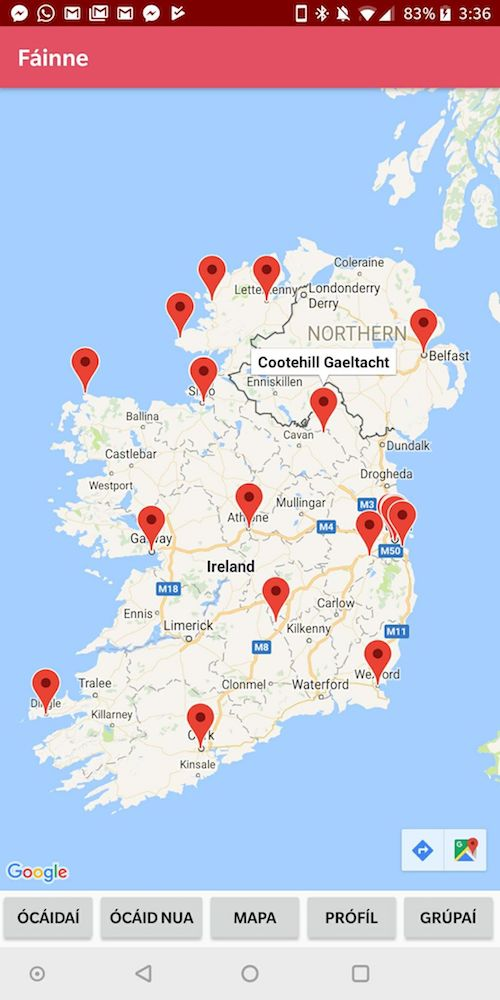
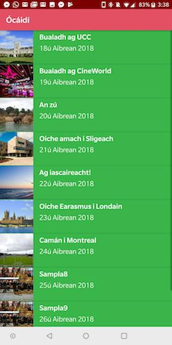
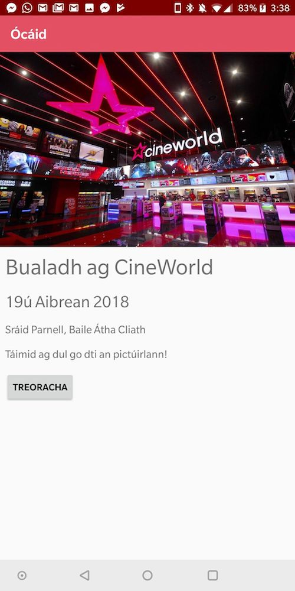
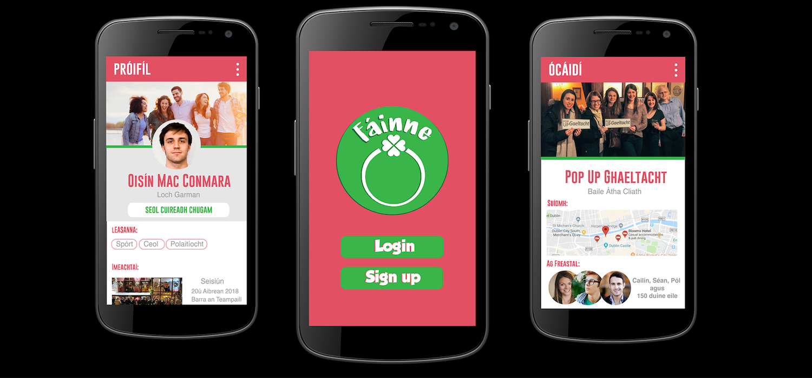

# Fáinne - Entry for Hackathon na Gaeilge 2018

This was my team's winning entry for Hackathon na Gaeilge - an app called Fáinne that lets users discover, organise and attend Irish language meetups across the world.

Most of the app isn't functional currently - it's mostly just pretty front-end stuff. We had a very limited amount of time to develop the app, and I was the only team member with app development skills, so I made the code myself in approx. six or seven hours. Chloe made all the mockups used in the presentation and in parts of the app (e.g. an Prófíl and the splashscreen) and the other team members focused on making the presentation we had to do at the end of the hackathon as Gaeilge.

The map function is based on Google Maps API V2 and [Google's sample code](https://github.com/googlemaps/android-samples/tree/master/tutorials/MapWithMarker), and I reused some code from my previous Android development projects.

Our team was comprised of:
- [Oisin Quinn](https://github.com/oisin1001) (that's me!)
- [Chloe Foxe](https://github.com/foxe22)
- [Darragh Clarke](https://github.com/DarraghClarke)
- [Sinead Farrell](https://github.com/sineadfarrell)
- [Charlie Kelly](https://github.com/charleskelly13)

If you're interested in our presentation, the slides are available [here](https://prezi.com/p/gchyxlaqr970/) - note: it's all in Irish!

## Screenshots

## Design mockups (for future development)

